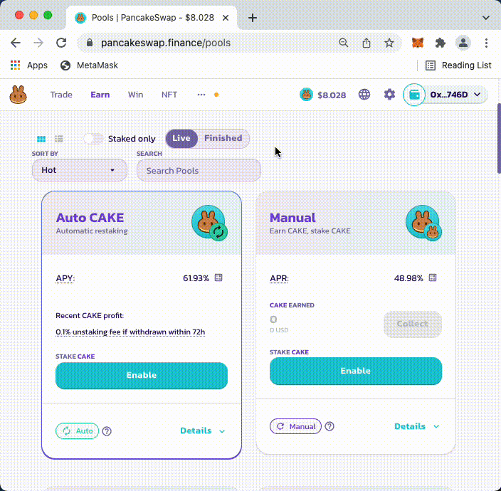
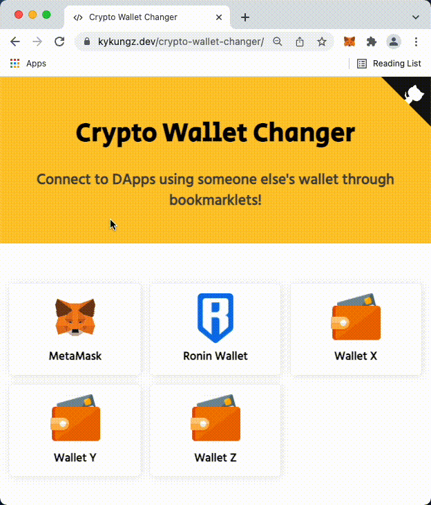

# Crypto Wallet Changer

> Connect to DApps using someone else's wallet through bookmarklets!<br>
> https://kykungz.github.io/crypt-wallet-changer

<p align="center">
  
</p>

## Why?

Sometimes you want "login" as other people's wallet on DApps (such as [PancakeSwap](https://pancakeswap.finance/), [Uniswap](https://app.uniswap.org/), etc.) whether you just want to see their assets, or you're just debugging something.

You can't really do that because crypto wallet like [MetaMask](https://metamask.io/) requires you to import that wallet using Seed Phrase or Private Key.

This bookmarklet aims to help you perform a "view-as"-like functionality, by injecting scripts that tells the DApps to read your wallet address that you filled in.

## How this works?

Most crypto wallet extensions injects a variable into browser's global variable `window`.

For example, [MetaMask](https://metamask.io/) injects a variable named `ethereum` into browser's `window`, so you could use `window.ethereum` to perform operations on the wallet extension.

DApps sites like [PancakeSwap](https://pancakeswap.finance/) retrieve wallet information from that `window.ethereum` variable when you connects to their website. These DApps are also listening on events that are sent from the extension, important events such as "Account Connected" or "Account Changed".

This bookmarklet just simply try to emit those events and tricks the website to think that you have changed your wallet to the one you filled it.

For example, emitting `account changed to <user_input>` event.

## Installation

Easy, as this project works as a [Bookmarklet](https://en.wikipedia.org/wiki/Bookmarklet), you can simply visit https://kykungz.github.io/crypto-wallet-changer and drag a wallet into your Bookmarks bar of your browser.

<p align="center">
  
</p>

Once you have it added to your Bookmarks bar, go to your favorite DApps site, and simply click on the saved bookmarklet to run the scripts.

A prompt will be shown, then you can paste any wallet address you want it to be viewed as.

<p align="center">
  
</p>

Note that this only tricks the webpage to think that you have changed your wallet to the one you filled in. You can't really sign transactions using this method since you don't have the private key.

## Contribute
Feel free to contribute to this repository!

To create a new bookmarket:
1. Add a new JavaScript file in `bookmarklets` folder
2. Add `module.exports` with the following structure:
```js
module.exports = {
  name: "MetaMask",
  logo: "https://....",
  script: function () {
    // Code goes here
  },
};
```
3. Run the following script to auto-generate the newly added bookmarklet:
```sh
node generate.js
```
4. Open `index.html` to see changes and test it out
5. Send a [Pull Request](https://github.com/kykungz/crypto-wallet-changer/pulls)!
